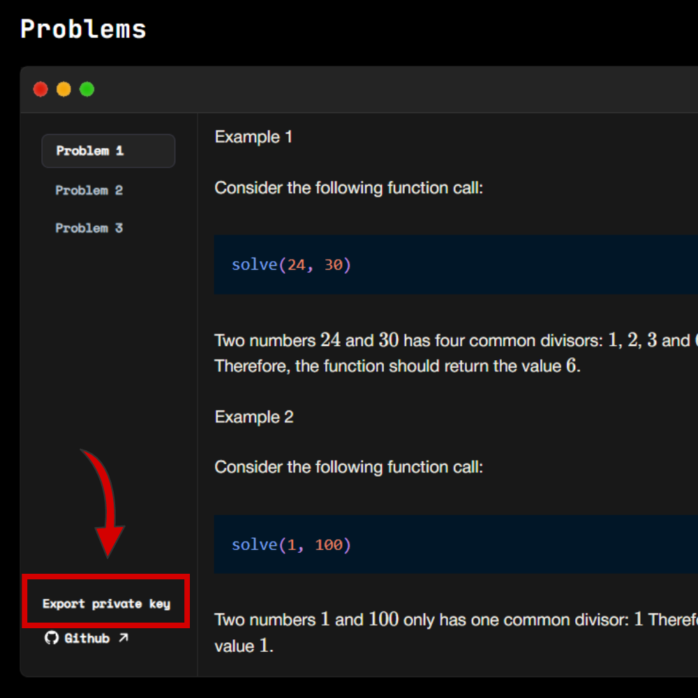

# Proof of Code Practice

# Introduction

Welcome to Proof of Code!

Proof of Code is a free crypto coding competition with weekly prize pools, focusing initially on Solidity problems.

Hosted by BVM, the leading Rollup-As-A-Service platform on Bitcoin, allowing anyone to launch their own blockchains on Bitcoin at low cost!

More info about Proof of Code: [BVMPoC](https://bvm.network/PoC)

# Register 
To register for Proof Of Code, please `sign in` at [BVMPoC](https://bvm.network/PoC).

# Solve problems
To solve problems, follow these steps:
## Step 1: Clone the Repository
Clone this repository using the command:
```
git clone https://github.com/TrustlessComputer/poc-practice.git
```
## Step 2: Install Dependencies
Navigate to the project directory and install the required dependencies:
```
cd poc-practice
npm install 
```
## Step 3: Create a wallet
Go to [BVMPoC](https://bvm.network/PoC).
Click `Sign in` using your Twitter or Gmail account.
Export your private key from the website. 



## Step 4: Set Up Your Private Key
Create a `.env` file in the root directory of the project and add your private key as follows:

```bash
ZKNET_DEPLOYER_PRIVATE_KEY=YOUR_PRIVATE_KEY
```

## Step 5: Solve the Problem
Each problem is located in its own folder. For example, the problem `ArraySort` can be found in the [ArraySort](contracts/ArraySort/) folder. The problem must be solved using Solidity.
For the ArraySort problem, you will find two files: [ArraySort.sol](contracts/ArraySort/ArraySort.sol) and [IArraySort.sol](contracts/ArraySort/IArraySort.sol). To solve the `ArraySort` problem, modify the `solve` function in [ArraySort.sol](contracts/ArraySort/ArraySort.sol).

## Step 6: Deploy Your Solution to BVM Chain

To deploy your solution, run the deployment script. For example, to deploy the `ArraySort` solution, use the following command:

```bash
npx hardhat run scripts/deployArraySort.ts --network zknet
```

*Note: The competition and practice sessions are completely free to join, you won’t have to pay anything. All gas fees are automatically covered in the backend.**

## Step 7: Test Your Solution
Following deployment, you will receive the address of the deployed contract. Use this address to test your solution. For example, to test the deployed ArraySort solution, use the following command:
```bash
bash test-arraysort.sh <CONTRACT_ADDRESS>
```
## Step 8: Submit Your Solution
You can submit your solution by using the following command:
```bash
bash submit.sh <problem_id> <tx_id>
```
# Need help?
Join the Proof of Code community: [PoC](https://t.me/PoCBVM).